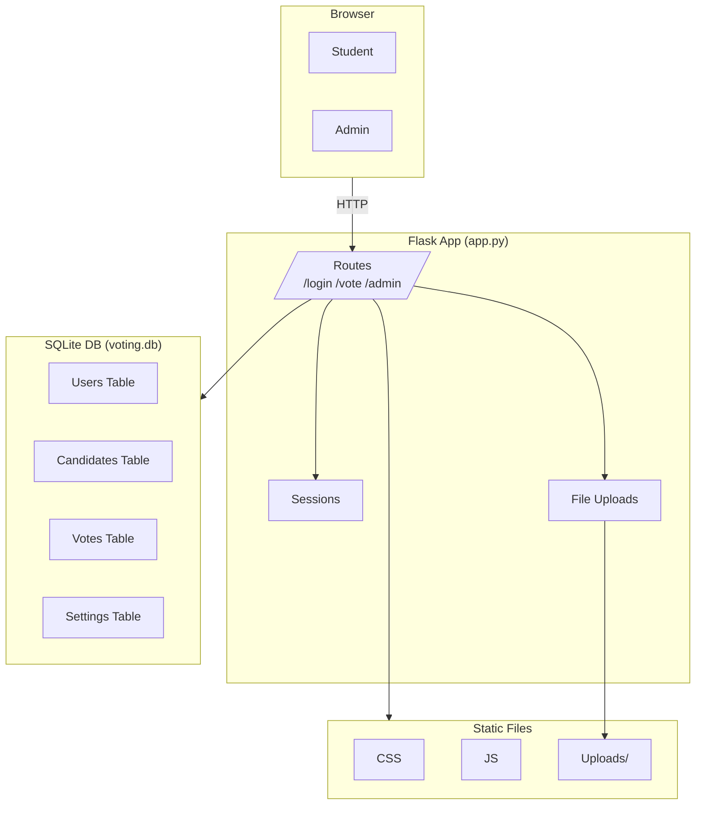
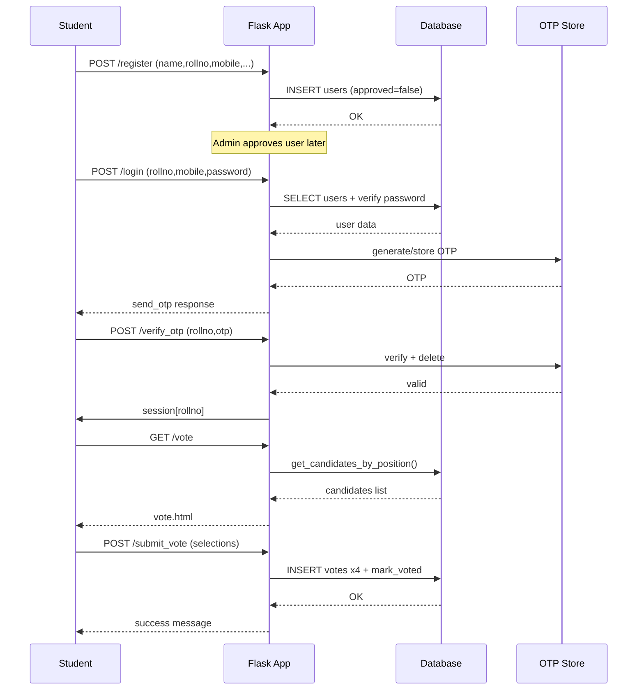
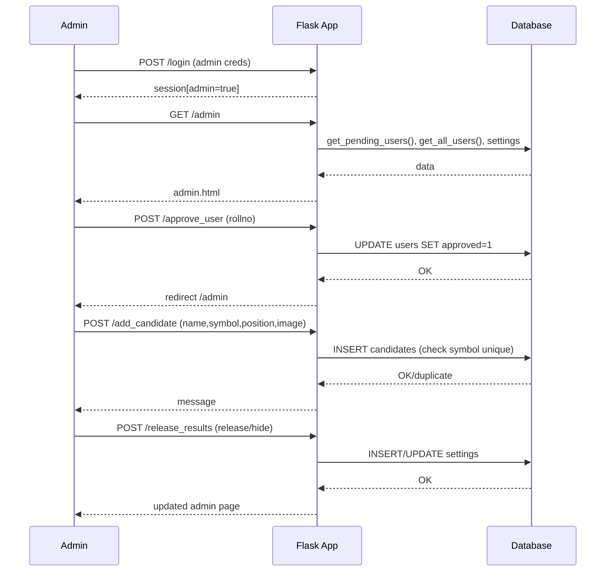

# UML Diagrams for Voting System

## 1. Class Diagram (Database Entities)

```mermaid
classDiagram
    class User {
        -id: int PK
        -name: string
        -rollno: string UK
        -mobile: string
        -email: string
        -password: string
        -voted: bool
        -photo: string
        -approved: bool
    }
    
    class Candidate {
        -id: int PK
        -name: string
        -symbol: string
        -position: string
        -image: string
    }
    
    class Vote {
        -id: int PK
        -rollno: string FK
        -position: string
        -candidate: string
    }
    
    class Setting {
        -key: string PK
        -value: string
    }
    
    User ||--o{ Vote : casts
    Candidate ||--o{ Vote : receives
```

## 2. Component Diagram



## 3. Sequence Diagram - Student Voting Flow



## 4. Sequence Diagram - Admin Flow



**View Instructions**: Open `uml_diagrams.md` in VSCode/GitHub for interactive Mermaid rendering. Diagrams based on code analysis of app.py, db.py, templates.

